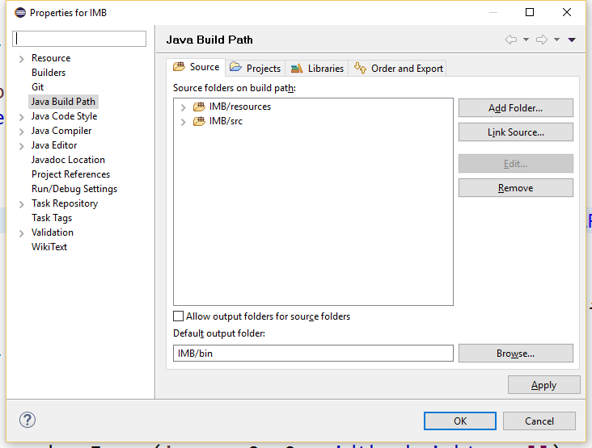
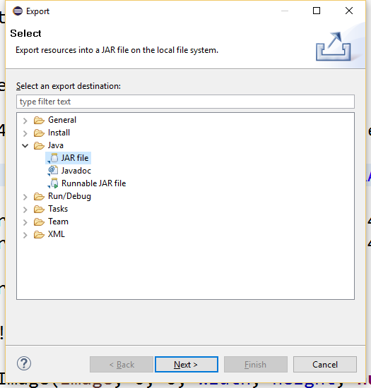

Infinite Mario Bros.
======================

Project fork of the [Infinite Mario Bros](http://www.mojang.com/notch/mario/) source code in order to apply some needed fixes/customizations:

- Game runs in fullscreen.
- Screens are now back-navigable using ESC.
- Ignored/removed code about the Scale2x class (seemed not to work properly in the original source).
- Source files (`src`) and resource (`resources`) folders moved up to project root.

## Compiling with Eclipse

Create a new project and import both source and resources folders. Add both the `src` and the `resource` folders to the build path (right-click the project name in the Package Explorer, select "properties" menu, then "Java Build Path" option, and add both folders to the list "Source files on build path"):

Then, export to a JAR using the exporting wizard (go to "File" menu, select "Export...", and then use the "JAR file" option in the Java category):

Do not forget to set `com.mojang.mario.FrameLauncher` as the class of the application entry point when requested.

Enjoy! :)
